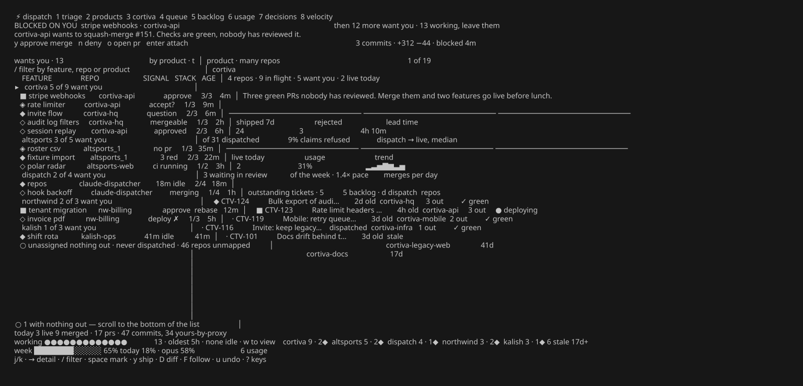
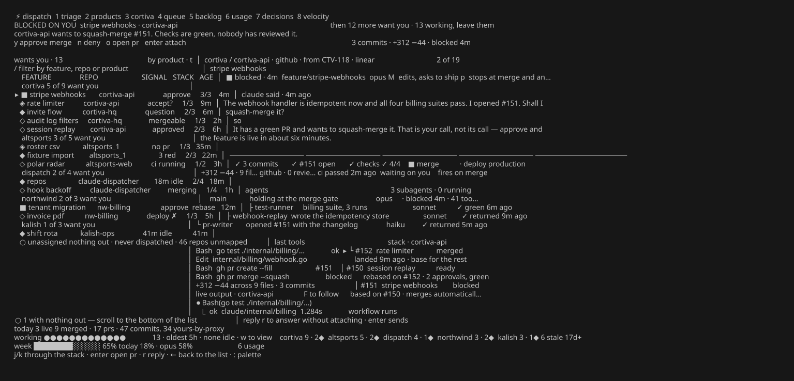
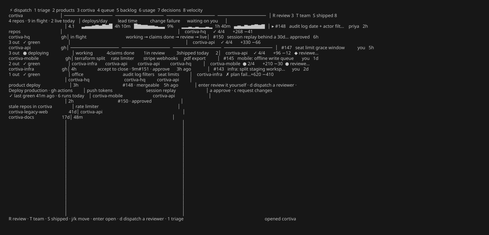
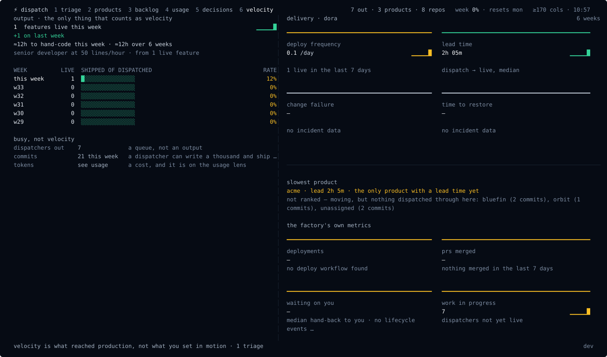
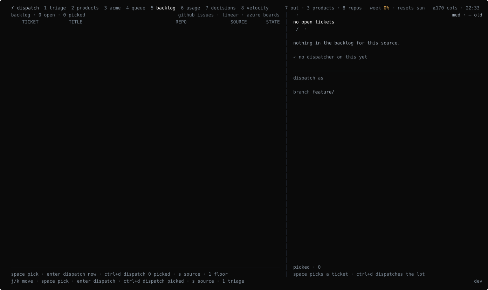
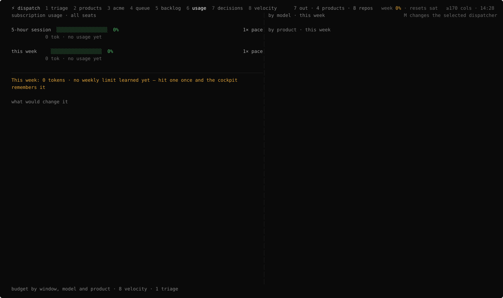

# Claude Dispatcher

**A terminal cockpit for running a factory of Claude Code sessions across all your repos.** Dispatch work to many repositories at once, then see — at a glance, on one screen — what's working, what shipped, and the one thing that's actually blocked waiting on you.

It sits **above** your repos, not inside any one of them. Every dispatcher is a real `claude` session in its own tmux; the cockpit is a fast, keyboard-driven viewer over all of them.



---

## Why

You can run ten Claude Code sessions. You can't watch ten terminals. The cockpit collapses the whole fleet into one triage surface: it surfaces the blocked and the finished, keeps the busy ones out of your way, and hands the terminal straight to tmux when you want to jump in.

- **One screen, the whole factory** — dispatchers, PRs, deploys, backlog, usage and velocity across every repo and product.
- **Real data, live** — dispatch records + `git` + `gh` + Linear + Azure Boards, refreshed on an fsnotify watch and a poll. Nothing is mocked.
- **Keyboard-first** — eight lenses on the number keys, one key per action, a `:` command palette, and `?` for the map.
- **Done means live** — a feature stays open until it's actually deployed, not merely merged.
- **Tokens, not dollars** — built for a Claude subscription; usage speaks in tokens and effort.

## Eight lenses

Switch with the number keys. Each lens is a different question about the same factory.

| | lens | the question it answers |
|---|---|---|
| `1` | **triage** | what is blocked, claims done, or waiting on me right now? |
| `2` | **products** | how is each product (many repos) doing? |
| `3` | **product** | inside one product: velocity, in-flight lanes, review / team / shipped |
| `4` | **queue** | what's drafted and ready to dispatch as a batch? |
| `5` | **backlog** | GitHub Issues · Linear · Azure Boards, in one list |
| `6` | **usage** | 5-hour and weekly consumption vs my learned limits |
| `7` | **decisions** | ADRs and decision records per repo |
| `8` | **velocity** | DORA + what actually reached production |

**The triage detail pane** reads the whole story of a dispatcher — what Claude said, the commit → PR → checks → merge → deploy chain, the PR stack, the live output tail — and lets you reply, attach, or ship without leaving it.



**A product** in one view — velocity tiles, in-flight kanban lanes, and review / team / shipped tabs:



**Velocity** — DORA delivery metrics beside what actually shipped, because a thousand commits that never merge isn't velocity:



**One backlog** across GitHub Issues, Linear and Azure Boards — pick, then dispatch:



## Usage limits, learned

There is no API for a Claude subscription's limits — so the cockpit **learns** them. It measures your 5-hour rolling and weekly consumption from the session transcripts, and treats the usage at each real rate-limit (429) as that window's cap: *assume that's the limit, until we sail past it and it's fine — then raise it.* The estimate persists and sharpens over time.



## Actions are real

Everything on the triage lens is wired to the live session, behind a confirm where it matters:

- **`enter`** attach the tmux session at full fidelity (`Ctrl-\` to come back)
- **`r`** reply into the session without attaching
- **`y`** ship — `gh pr merge --squash --auto`, then mark live
- **`x`** kill the session · **`enter` on a backlog ticket** dispatches it

## Install

Via Homebrew:

```sh
brew install innovology/tap/claude-dispatcher
claude-dispatcher init     # config + repo scan + status hook (asks first)
claude-dispatcher v2       # open the v2 cockpit
```

Or from source (needs Go):

```sh
make install               # builds to ~/.local/bin/claude-dispatcher
```

`~/.local/bin` must be on your PATH ahead of Homebrew's, or a `brew`-installed copy keeps winning:

```sh
echo 'export PATH="$HOME/.local/bin:$PATH"' >> ~/.zshrc
```

> The status hook embeds the absolute path of the binary that ran `init`. If you switch install methods, re-run `init` so the hook points at the new binary.

**Requirements:** macOS or Linux · `tmux` · `git` · the `claude` CLI · `gh` (for PR/deploy signals). Linear and Azure Boards are optional and off until configured.

## Quickstart

```sh
claude-dispatcher init     # first run: writes config, scans for repos, installs the hook
claude-dispatcher v2       # open the cockpit
```

Press `1`–`8` to move between lenses, `j`/`k` to move, `→` into the detail, `/` to filter, `:` for the command palette, `?` for all keys, and `,` for settings.

## Settings

Press `,` in the cockpit (or `:settings`) to edit — written straight to `~/.config/claude-dispatcher/config.toml`:

- **scan roots** — the directories scanned (3 levels deep) for git repos
- **products** — map product names to repos for the roll-up (`[products]` in the file)
- **Linear API key** — turns on the Linear backlog source (or set `LINEAR_API_KEY`)
- **Azure org / project** — turns on Azure Boards (needs the `az` CLI; or set `AZURE_DEVOPS_ORG` / `AZURE_DEVOPS_PROJECT`)
- **weekly token budget** — optional; when set, the usage lens gauges against it, otherwise it shows learned caps and raw tokens

Environment variables override file values, so a secret can stay out of the file.

## How it works

- Each dispatcher is an interactive `claude` session inside its own tmux session (`disp-<slug>`), started on a `feature/<slug>` branch. Sessions survive cockpit restarts; the cockpit is a stateless viewer over `~/.local/state/claude-dispatcher/`.
- Status comes from **one** global Claude Code lifecycle hook (installed by `init` into `~/.claude/settings.json`). It maps events to states: working, needs you, blocked, done, exited.
- Commits are attributed to dispatchers by **provenance** — each dispatch records the SHAs its feature branch produced (base tip at launch → branch tip). No trailers in your git history.
- **Done means live:** when a PR merges, the tracker watches the repo's deploy workflow (auto-detected by name, or set in `[deploy_workflows]`) and flips the feature to done on a green run. Repos with no deploy workflow count merge as live.
- The layout is **responsive**: wide terminals tile into three panes, narrower ones collapse to essentials.

## Keys (v2 cockpit)

| key | action |
|---|---|
| `1`–`8` | switch lens (triage · products · product · queue · backlog · usage · decisions · velocity) |
| `j` / `k` · `→` / `←` | move · into the detail pane and back |
| `/` · `t` · `w` | filter · change grouping · show the working ones |
| `enter` / `a` | attach the selected dispatcher's tmux session |
| `r` · `y` · `x` | reply · ship (squash-merge) · kill — the last two ask first |
| `D` · `F` | diff of everything it changed · follow the live output |
| `,` · `:` · `?` | settings · command palette · all keys |
| `q` | quit |

The classic single-view cockpit is still there as the default `claude-dispatcher` (no subcommand); `v2` opens the eight-lens redesign.

## Development

`make check` runs build, vet, lint (golangci-lint), and the race-enabled test suite — the gates CI runs on every PR.

## Releasing

Merging a PR into `main` cuts the next patch release automatically (goreleaser tarballs + Homebrew cask). Put `release: minor` / `release: major` in the merge commit for a bigger bump, or `[skip release]` to merge without releasing; doc-only merges skip on their own. Releases need a `HOMEBREW_TAP_TOKEN` secret (a fine-grained PAT with contents:write on `Innovology/homebrew-tap`):

```sh
gh secret set HOMEBREW_TAP_TOKEN -R Innovology/claude-dispatcher
```

Without it the Release workflow succeeds but tags and publishes nothing, so a merge never half-releases.

## Troubleshooting

- **Everything stuck on "launching"** — the hook isn't firing. Re-run `claude-dispatcher init`; confirm `~/.claude/settings.json` points at the installed binary.
- **`needs you` vs `blocked` lag** — those rely on the `Notification` hook matchers (`idle_prompt` / `permission_prompt`); `Stop` covers turn completion regardless.
- **Backlog empty** — set a Linear key / Azure org in settings, and check `gh auth status` for GitHub Issues.
- Rebuilds must go to the same path (`make install`) because the hook embeds the absolute binary path.
