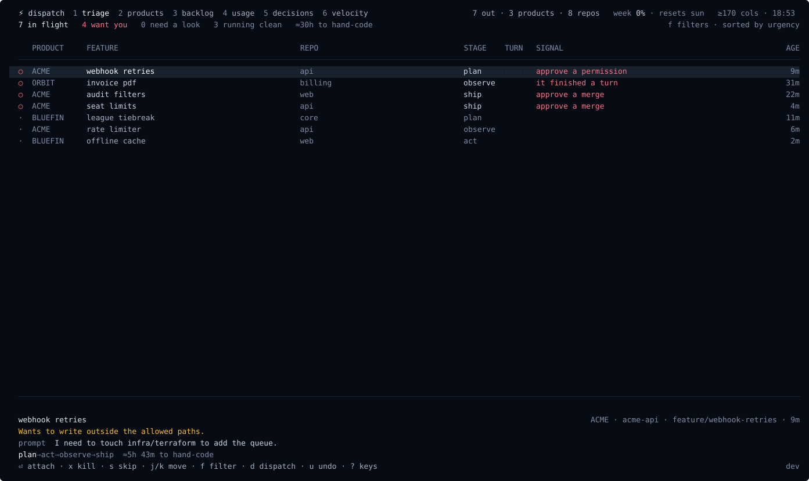
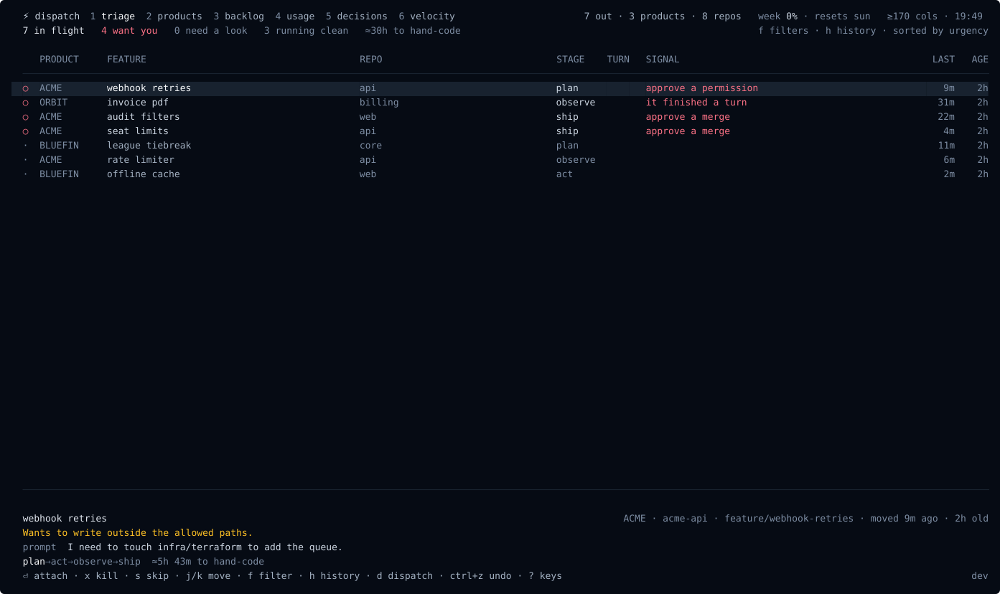
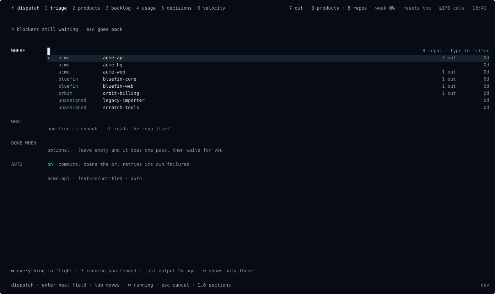
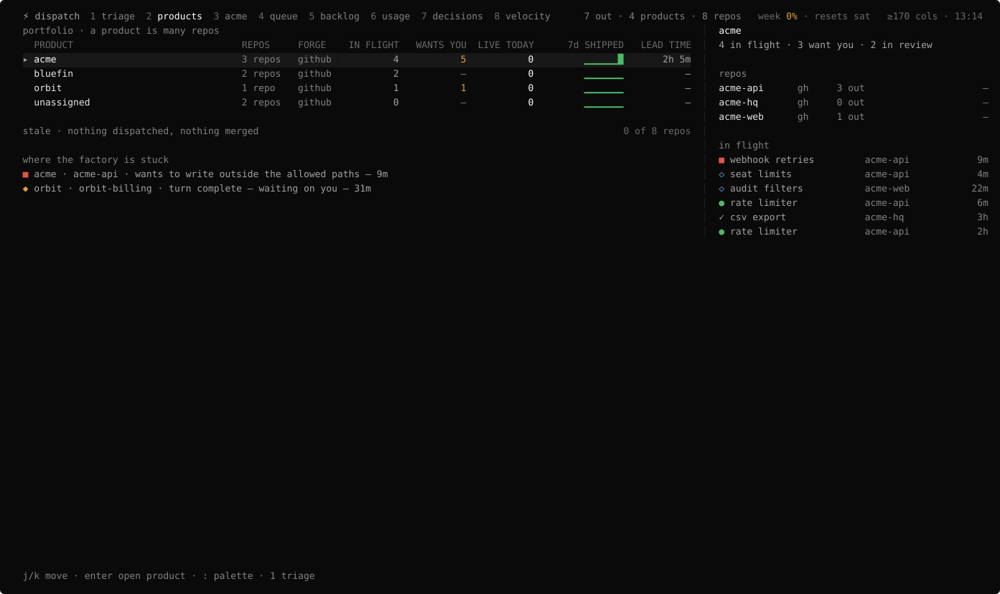
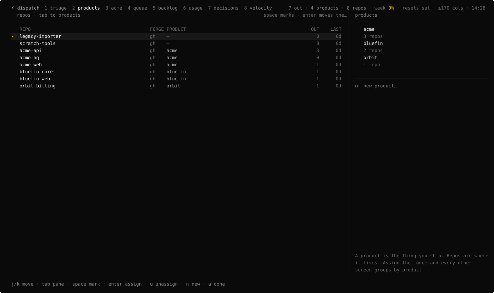

# Claude Dispatcher

**A terminal cockpit for running a factory of Claude Code sessions across all your repos.** Dispatch work to many repositories at once, then see — at a glance, on one screen — what's working, what shipped, and the one thing that's actually blocked waiting on you.

It sits **above** your repos, not inside any one of them. Every dispatcher is a real `claude` session in its own tmux; the cockpit is a fast, keyboard-driven viewer over all of them.



---

## Why

You can run ten Claude Code sessions. You can't watch ten terminals. The cockpit collapses the whole fleet into one triage surface: it surfaces the blocked and the finished, keeps the busy ones out of your way, and hands the terminal straight to tmux when you want to jump in.

- **One screen, the whole factory** — dispatchers, PRs, deploys, backlog, usage and velocity across every repo and product.
- **Real data, live** — dispatch records + `git` + `gh` + Linear + Azure Boards, refreshed on an fsnotify watch and a poll. Nothing is mocked.
- **Keyboard-first** — six lenses on the number keys, one key per action, a `:` command palette, and `?` for the map.
- **Done means live** — a feature stays open until it's actually deployed, not merely merged.
- **Tokens, not dollars** — built for a Claude subscription; usage speaks in tokens and effort.

## Six lenses

Switch with the number keys. Each lens is a different question about the same factory.

| | lens | the question it answers |
|---|---|---|
| `1` | **triage** | what is blocked, claims done, or waiting on me right now? |
| `2` | **products** | how is each product (many repos) doing? `enter` opens one |
| `3` | **backlog** | GitHub Issues · Linear · Azure Boards, in one list |
| `4` | **usage** | 5-hour and weekly consumption vs my learned limits |
| `5` | **decisions** | ADRs and decision records per repo |
| `6` | **velocity** | DORA + what actually reached production |

**Triage is the whole fleet, ranked.** One table of everything in flight — the dispatchers that want you above the ones getting on with it — and a detail panel for the row under the cursor: what it wants, where it stands, and the keys that answer it. The cursor holds its row across refreshes, so nothing moves under your hands.

**`w` narrows to what is running.** Everything working away unattended, with how long since each one last said anything. Nothing there needs you — which is why it sorts below what does. `f` cycles the other filters.



**With the fleet clear, the same screen becomes the prompt.** Type what to build and press enter; `tab` picks the repo.



**A product** is many repos — the portfolio roll-up, what is stale, and where the factory is stuck:



**Press `a` to say which repos make up which product.** Mark repos with `space`, `enter` moves them into the selected product, `n` names a new one. It writes straight to `[products]` in your config, so the grouping every other lens uses is one screen away rather than a file you have to remember the syntax for.



**Velocity** — DORA delivery metrics beside what actually shipped, because a thousand commits that never merge isn't velocity:


**One backlog** across GitHub Issues, Linear and Azure Boards — pick, then dispatch:


## Usage limits, learned

There is no API for a Claude subscription's limits — so the cockpit **learns** them. It measures your 5-hour rolling and weekly consumption from the session transcripts, and treats the usage at each real rate-limit (429) as that window's cap: *assume that's the limit, until we sail past it and it's fine — then raise it.* The estimate persists and sharpens over time.


## Actions are real

Every act the table offers is wired to the live session — the key hints show only what the selected dispatcher can actually do:

- **`enter`** attach the tmux session at full fidelity (`Ctrl-\` to come back)
- **`y`** on a PR waiting to merge: `gh pr merge --squash --auto`, then mark live. Elsewhere it marks the record shipped, and it is hidden entirely when the dispatcher has produced no commits
- **`x`** kill the session · **`s`** skip to the back of the table · **`u`** undo
- **`d`** open the prompt · **`f`** / **`w`** filter the table · **`enter` on a backlog ticket** dispatches it

## Install

Via Homebrew:

```sh
brew install innovology/tap/claude-dispatcher
claude-dispatcher init     # config + repo scan + status hook (asks first)
claude-dispatcher            # open the cockpit
```

Or from source (needs Go):

```sh
make install               # builds to ~/.local/bin/claude-dispatcher
```

`~/.local/bin` must be on your PATH ahead of Homebrew's, or a `brew`-installed copy keeps winning:

```sh
echo 'export PATH="$HOME/.local/bin:$PATH"' >> ~/.zshrc
```

> The status hook embeds the absolute path of the binary that ran `init`. If you switch install methods, re-run `init` so the hook points at the new binary.

**Requirements:** macOS or Linux · `tmux` · `git` · the `claude` CLI · `gh` (for PR/deploy signals). Linear and Azure Boards are optional and off until configured.

## Windows

**Recommended: run under WSL2.** The full experience — real `tmux`, in-place attach, reply-without-attaching, the whole cockpit — depends on `tmux` as the process supervisor, and `tmux` is a Linux tool. Install a WSL2 distro (Ubuntu is fine), then use the **Linux** build exactly as documented above (`brew` via Linuxbrew, or `make install`). This is the recommended way to run the dispatcher on a Windows machine.

**Native preview (winget / scoop).** A native Windows build is published for early access once the publishers below are configured. It is honestly a preview: without `tmux` there is no shared session multiplexer, so **each dispatch opens in its own console window**, and **in-place attach (window focus) and reply (console input injection) are best-effort and still being hardened** — the `tmux`-grade session model for Windows is still being built. For the real cockpit experience today, use WSL2, and watch the cockpit as the native session model lands.

Once configured, install natively with:

```powershell
winget install Innovology.claude-dispatcher
# or
scoop bucket add innovology https://github.com/Innovology/scoop-bucket
scoop install claude-dispatcher
```

## Quickstart

```sh
claude-dispatcher init     # first run: writes config, scans for repos, installs the hook
claude-dispatcher            # open the cockpit
```

Press `1`–`6` to move between lenses. On triage, `j`/`k` move down the fleet, act on the selected row or `s` to skip it; `f` and `w` filter, `d` opens the prompt. Elsewhere `j`/`k` move and `enter` opens. `:` is the command palette, `?` lists every key, and `,` opens settings.

## Settings

Press `,` in the cockpit (or `:settings`) to edit — written straight to `~/.config/claude-dispatcher/config.toml`:

- **scan roots** — the directories scanned (3 levels deep) for git repos
- **Linear API key** — turns on the Linear backlog source (or set `LINEAR_API_KEY`)
- **Azure org / project** — turns on Azure Boards (needs the `az` CLI; or set `AZURE_DEVOPS_ORG` / `AZURE_DEVOPS_PROJECT`)
- **weekly token budget** — optional; when set, the usage lens gauges against it, otherwise it shows learned caps and raw tokens

Environment variables override file values, so a secret can stay out of the file.

**Products** are edited on the products lens (`2`, then `a`), which writes the table below for you. You can still group them by hand in `~/.config/claude-dispatcher/config.toml`, using each repo's directory name:

```toml
[products]
acme    = ["acme-api", "acme-web", "acme-hq"]
bluefin = ["bluefin-core", "bluefin-web"]
```

Anything unmapped is grouped under `unassigned`, which is what a fresh install shows.

## How it works

- Each dispatcher is an interactive `claude` session inside its own tmux session (`disp-<slug>`), started on a `feature/<slug>` branch. Sessions survive cockpit restarts; the cockpit is a stateless viewer over `~/.local/state/claude-dispatcher/`.
- Status comes from **one** global Claude Code lifecycle hook (installed by `init` into `~/.claude/settings.json`). It maps events to states: working, needs you, blocked, done, exited.
- Commits are attributed to dispatchers by **provenance** — each dispatch records the SHAs its feature branch produced (base tip at launch → branch tip). No trailers in your git history.
- **Done means live:** when a PR merges, the tracker watches the repo's deploy workflow (auto-detected by name, or set in `[deploy_workflows]`) and flips the feature to done on a green run. Repos with no deploy workflow count merge as live.
- The layout is **responsive**: wide terminals tile into three panes, narrower ones collapse to essentials.

## Keys

| key | action |
|---|---|
| `1`–`6` | switch lens (triage · products · backlog · usage · decisions · velocity) |
| `+` | dispatch new work — repo → feature → prompt |
| `j` / `k` · `g` / `G` | move · first row · last row |
| `f` · `w` | cycle the triage filter · running only, and back |
| `enter` | attach the selected dispatcher's tmux session · open what is selected |
| `y` · `x` · `s` | ship (squash-merge) · kill · skip to the back |
| `d` · `u` | dispatch · put back the last thing you cleared |
| `,` · `:` · `?` | settings · command palette · all keys |
| `q` | quit |


## Development

`make check` runs build, vet, lint (golangci-lint), and the race-enabled test suite — the gates CI runs on every PR.

## Releasing

Merging a PR into `main` cuts the next patch release automatically (goreleaser builds macOS/Linux tarballs, Windows `.zip`s, and the Homebrew cask). Label the PR `release:minor` / `release:major` (or `skip-release`) to control the bump — the PR template reminds you. A `release: minor` line or `[skip release]` in the merge commit still works as a fallback; doc-only merges skip on their own. Releases need a `HOMEBREW_TAP_TOKEN` secret (a fine-grained PAT with contents:write on `Innovology/homebrew-tap`):

```sh
gh secret set HOMEBREW_TAP_TOKEN -R Innovology/claude-dispatcher
```

Without it the Release workflow succeeds but tags and publishes nothing, so a merge never half-releases.

### Windows publishing (optional)

The `scoop` and `winget` publishers are wired into `.goreleaser.yml` but stay a no-op until you set their tokens — the existing macOS/Linux + Homebrew release keeps working unchanged with only `HOMEBREW_TAP_TOKEN`. To turn on native Windows publishing, set up each publish repo exactly like the Homebrew tap:

- **scoop** — create an `Innovology/scoop-bucket` repo, then add a fine-grained PAT with contents:write on it:

  ```sh
  gh secret set SCOOP_BUCKET_TOKEN -R Innovology/claude-dispatcher
  ```

- **winget** (optional) — fork `microsoft/winget-pkgs` to `Innovology/winget-pkgs`, then add a PAT with contents:write on the fork (goreleaser opens the manifest PR against it under publisher `Innovology`):

  ```sh
  gh secret set WINGET_TOKEN -R Innovology/claude-dispatcher
  ```

Each publisher's `skip_upload` is templated on its token, so an unset token means the manifest is generated but never pushed — a release can never half-publish.

## Troubleshooting

- **Everything stuck on "launching"** — the hook isn't firing. Re-run `claude-dispatcher init`; confirm `~/.claude/settings.json` points at the installed binary.
- **`needs you` vs `blocked` lag** — those rely on the `Notification` hook matchers (`idle_prompt` / `permission_prompt`); `Stop` covers turn completion regardless.
- **Backlog empty** — set a Linear key / Azure org in settings, and check `gh auth status` for GitHub Issues.
- Rebuilds must go to the same path (`make install`) because the hook embeds the absolute binary path.
